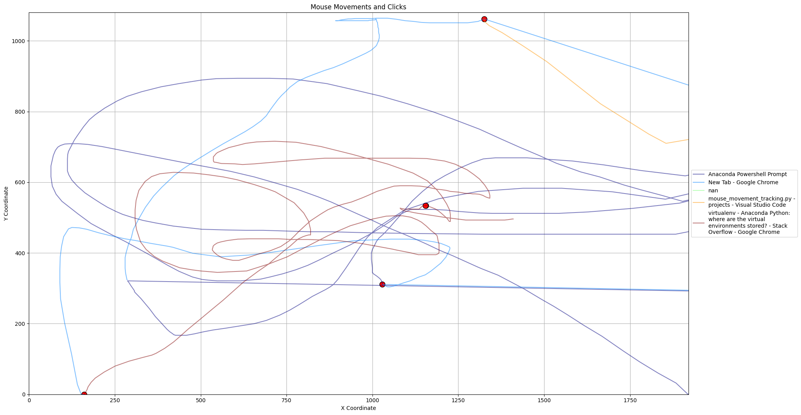

# Mouse Movement Tracker
This Python script allows users to track their mouse movements over a specified duration and records the positions, mouse clicks, and the title of the active window. The data is then exported to a CSV file and can be visualized using a separate script.




## Features
- Track mouse position at millisecond intervals.
- Record mouse clicks (left, right, middle, etc.).
- Capture the title of the currently active window.
- Export the recorded data to a CSV file named in the format "mouse_data_YYYYMMDD_HHMMSS.csv".
- Visualize the mouse data, differentiating between:
  - Mouse movement trajectories.
  - Different mouse click activities (e.g., left click, right click).
- Option to differentiate trajectories based on active window titles.


## Prerequisites
Ensure you have Python installed on your machine. This script was developed using Python 3.x.

## Installation
1. Clone the repository:
  ```
  git clone https://github.com/your_username/track_mouse_movement.git
  ```
2. Navigate to the project directory:
  ```
  cd track_mouse_movement
  ```
3. Install the required libraries:
  ```
  pip install -r requirements.txt
  ```
## Usage
### Recording Mouse Movements
1. Run the script:
  ```
  python mouse_movement_tracking.py
  ```
3. When prompted, enter the recording duration in seconds.
4. The script will then start recording the mouse data for the specified duration.
5. Once the recording is complete, you can find the CSV file in the `output` directory.

### Visualizing Mouse Movements
1. After generating the CSV file using the tracking script, run the visualization script:
  ```
  python visualize_movemovement.py --csv_path <path_to_your_csv_file.csv>
  ```
- Use a relative path from scripts folder or the absolute path. If your csv file is in output folder, a sample path is
  ```
  python visualize_movemovement.py --csv_path ..\output\mouse_data_20231006_115516.csv --include_movement True --include_active_windows True
  ```
- To visualize only the trajectories without mouse click activities:
 ```
 python visualize_movemovement.py --csv_path <path_to_your_csv_file.csv> --include_clicks False
 ```

- To visualize the trajectories without differentiating based on active window titles:
 ```
 python visualize_movemovement.py --csv_path <path_to_your_csv_file.csv> --include_active_windows False
 ```

2. The script will create a PNG image visualization of the mouse movements, clicks, and active window trajectories in the same directory with the same base name as the CSV.

## Caution
Always be cautious when using mouse and keyboard listeners, as they can capture sensitive information. Ensure you're aware of the data being recorded and stored.

## Contributing
Pull requests are welcome. For major changes, please open an issue first to discuss what you would like to change.

## License
[MIT] (https://choosealicense.com/licenses/mit/)
